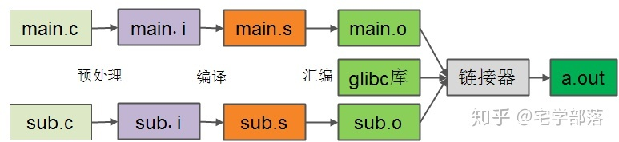

== GCC工具介绍
=== GCC的构成和编译过程
gcc安装完成后主要有三个目录 +
|---- bin +
| 包含了编译器(通常包含预处理器),汇编器,链接器, +
| 调试工具: nm,gdb,objcopy,objdump,readelf +
|---- lib +
| 存放了C标准库函数,包括静态库和动态库 +
|---- include +
| 存放C标准库头文件 +

.编译过程

