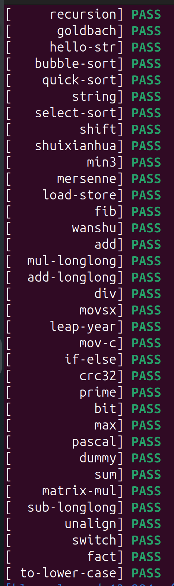
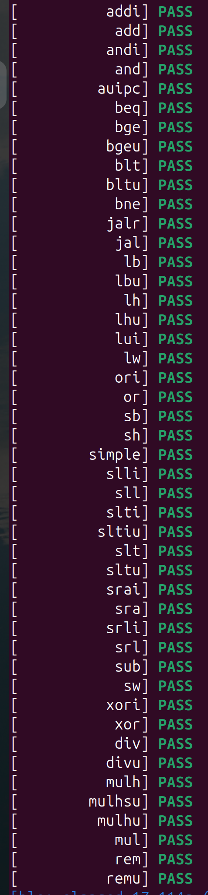
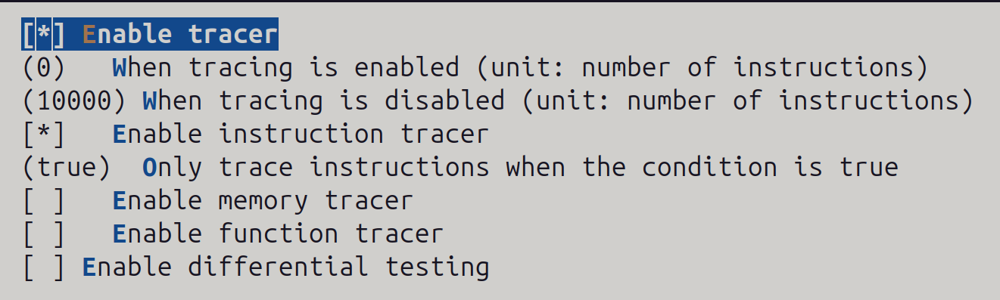
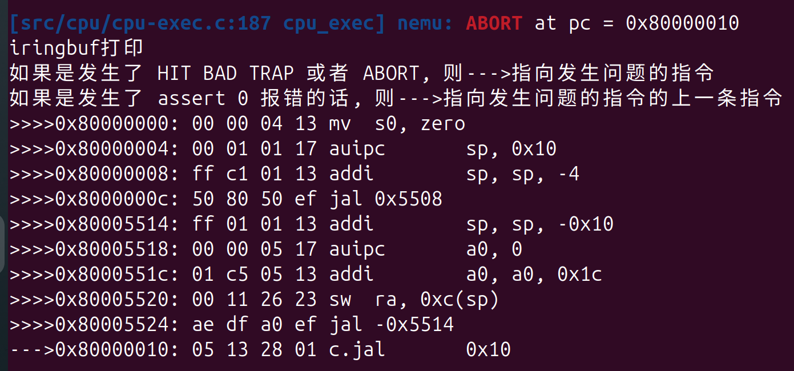
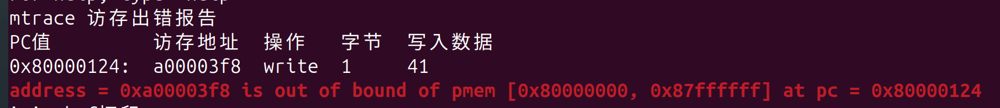
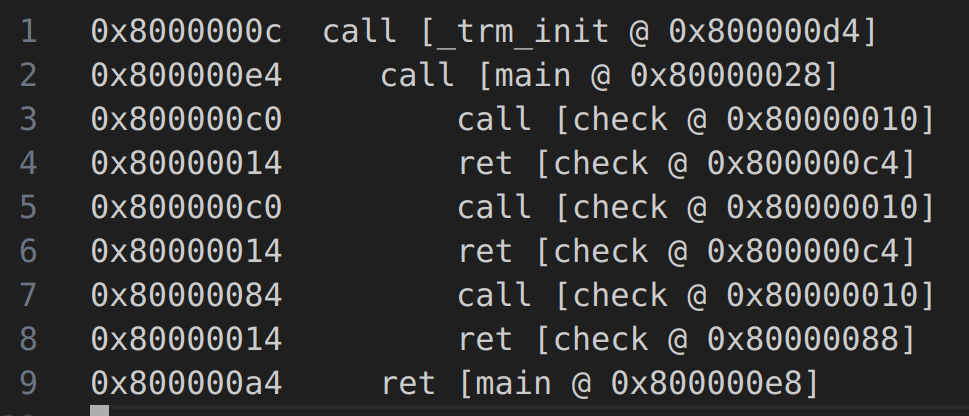

[[day2025-5-11]]
= 2025/5/11日单周分享会
Doc Writer: 谢平江;
2025/5/11
:toc: left
:toc-title: 目录
:toclevels: 3

== 学习进度
`**_完成了PA2.1和PA2.2的部分内容_**` +

=== nemu实现更多的指令
实现了rv32IM指令集除(fence, fence_tso, pause, ecall)的所有指令 

==== cpu-tests
通过了**am-kernels/tests/cpu-tests**中的所有测试,包括实现了AM的klib中一些库函数 +

.cpu-test

==== riscv-tests-am
通过了**am-kernels/tests/riscv-tests-am**中的所有测试 +

.riscv-tests-am

=== 完善nemu的基础设施
添加了iringbuf,mtracer,ftracer的功能

.menuconfig可配置tracer

==== iringbuf

.iringbuf展示

==== mtracer

.mtracer展示

==== ftracer

.ftracer展示

