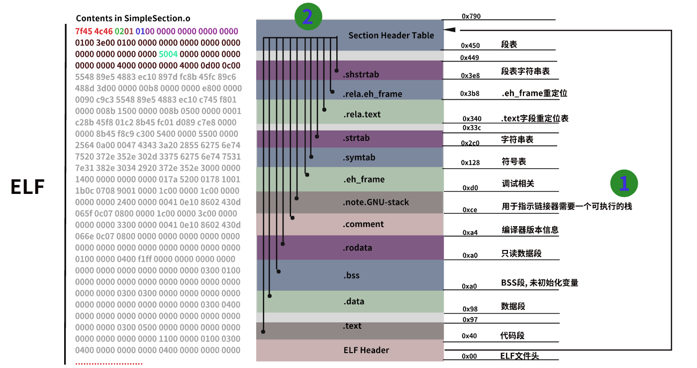
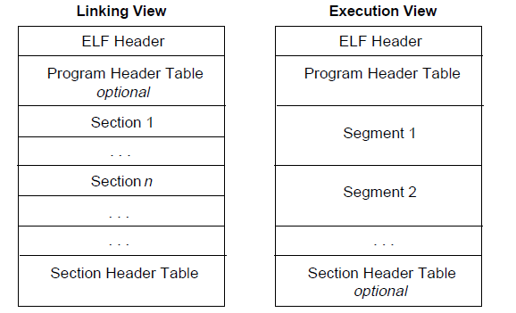
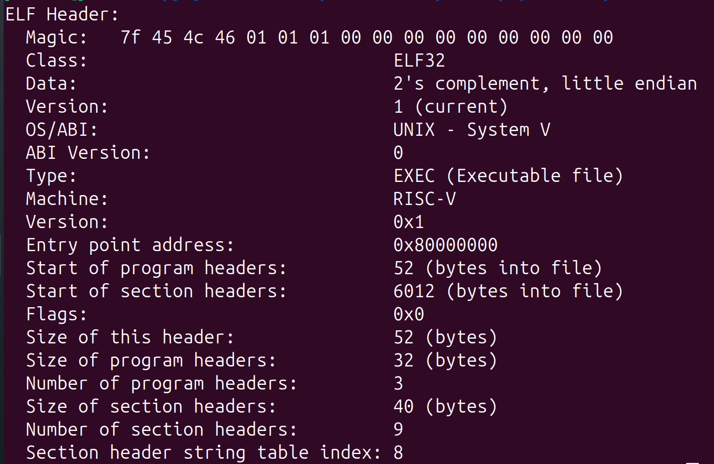
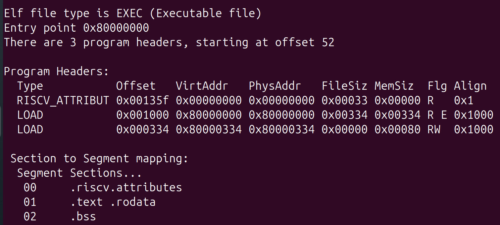
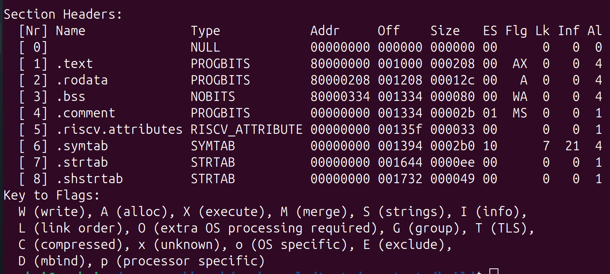

= GCC介绍
Doc Writer yunhaigushu;
v1.0, 2025-05-11
:toc: left
:toc-title: Directory
== GCC工具介绍
=== GCC的构成和编译过程
gcc安装完成后主要有三个目录 +
|---- bin +
| 包含了编译器(通常包含预处理器),汇编器,链接器, +
| 调试工具: nm,gdb,objcopy,objdump,readelf +
|---- lib +
| 存放了C标准库函数,包括静态库和动态库 +
|---- include +
| 存放C标准库头文件 +

.编译过程 版本1
image::../images/编译过程.jpg[]
.编译过程 版本2

=== readelf
ELF文件的类型有三种:Relocatable File 可重定位文件 `.o文件`;Executable File 可执行文件 `.out文件`;Shared Objected File 共享目标文件 `.so或者.a文件`.

.ELF文件结构 版本1

.ELF文件结构 版本2

[red]**ELF Header(ELF 文件头)**::
这里会显示整个文件的组织格式,使用命令 `readelf -h ELF文件` 可以查看

.ELF Header

`**Magic:**` **7f**固定,**45 4c 46**表示elf,**01**表示文件位数,**01**表示大小端,**01**表示ELF文件的主版本号 +
`**Class - ABI Version:**` **Magic**的可视化展示 +
`**Type:**` 文件类型,REL (Relocatable file)、DYN (Shared object file)、EXEC (Executable file) +
`**Machine:**` 硬件平台，此文件适合在哪个硬件平台下运行 +   
`**Entry point address:**` 代表程序入口的虚拟地址,只有可执行文件跟共享库有入口 +
`**Start of program headers:**` 表示程序头表(Program Header Table,PHT)的起始位置(相对于文件开头的偏移量) +
`**Start of section headers:**` 表示节头表(Section Header Table,SHT)的起始位置(相对于文件开头的偏移量) +
`**Size of this header:**` 这个ELF文件头的大小 +
`**Size of program header:**` 表示程序头表(Program Header Table,PHT)的大小 +
`**Number of program headers:**` 表示PHT的数量,每个PHT描述一个段 +
`**Number of section headers:**` 表示SHT的数量,每个SHT描述一个节 +

[red]**Segment(段)**::
这里的**Section**是ELF文件功能组织的程序单元,也是我们平时说的段(代码段,数据段),而**Segment(段)**是具有相同属性的**Section**的集合,可以使用命令 `readelf -l ELF文件` 查看ELF的PHT

.PHT

可以看到,最上面一段是概述;中间一段是描述了ELF文件三个段的属性;最后一段是描述了这些段都分别包含了哪些节

[red]**Section(节)**::
可以使用命令 `readelf -S ELF文件` 查看ELF文件的SHT

.SHT

可以看到SHT展示了所有的节和一些对应节的属性,下面介绍一些常见节的含义

`**.bbs:**` 存放未初始化的全局变量和局部变量,程序运行时这些变量会被初始化为0 +
`**.data:**` 存放初始化的全局变量和局部变量 +
`**.dynstr:**` 动态链接符号表 +
`**.rodata:**` 存放着只读的变量 +
`**.symtab:**` 符号表,存放了各个目标文件链接的接口 +
`**.text:**` 保存程序中的代码片段 +
`**.strtab:**` 字符串表,保存符号的名字,存放所有的字符串 +

[red]**readelf的常用命令**::
`readelf -e ELF文件` 查看全部头部信息,等同于-h -l -S +
`readelf -s ELF文件` 查看ELF文件的符号表 +
`readelf -x 节号/节名 ELF文件` 以字节格式查看指定Section(节) +
`readelf -p 节号/节名 ELF文件` 以字符串格式查看指定Section(节) +

