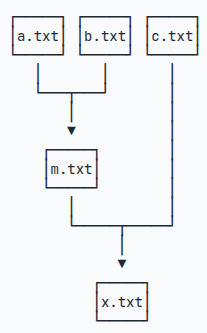

== Makefile常识
=== 规则
`Makeflie` 文件简单来说就是用来生成文件的。 +
如图1所示，我们需要使用 `a.txt`,`b.txt`,`c.txt` 三个文件来生成 `x.txt` 文件。

.生成文件

`Makefile` 文件由规则组成，每个规则由三部分组成：目标、依赖和命令。 +
[source,make]
----
# 目标文件: 依赖文件1 依赖文件2
#   命令
m.txt: a.txt b.txt
	cat a.txt b.txt > m.txt
----
`make` 命令默认执行第一个规则。执行时，`make` 会检查目标文件是否存在，如果不存在或者依赖文件有更新，则执行命令。如果依赖文件未就绪，`make` 会先执行依赖文件的规则，直到所有依赖文件都就绪为止。 +
`make` 命令会自动判断目标文件是否需要更新，如果需要更新，则执行命令。 +
所以实现上面目标的 `Makefile` 文件如下：
[source,make]
----
x.txt: m.txt c.txt
	cat m.txt c.txt > x.txt

m.txt: a.txt b.txt
	cat a.txt b.txt > m.txt
----
此时执行`make`命令将得到x.txt文件

=== 伪目标
我们在执行 `make clean` 时并没有生成 `clean` 文件，所以每次都将执行一边命令。
[source,make]
----
clean:
    rm -f x.txt m.txt
----
当然我们也可以将 `clean` 标记为一个伪目标，这样即使存在 `clean文件` ，命令也会执行
[source,make]
----
.PHONY: clean
clean:
    rm -f x.txt m.txt
----

=== 多条指令
下面这么执行多条指令并不正确，因为每条指令会在不同的 shell 中执行
[source,make]
----
cd:
	pwd
	cd ..
	pwd
----
常用的解决办法是使用 `;` 将多条指令连接起来，同时配合 `\` 符号进行换行
[source,make]
----
cd:
    pwd; \
    cd ..; \
    pwd
----
或者使用 `&&` 连接符，只有前面的命令成功执行后，才会执行后面的命令
[source,make]
----
cd:
    pwd && \
    cd .. && \
    pwd
----

=== 变量与变量赋值
对于重复出现的语句都可以用**大写**的变量表示,而通常使用 `=`,`:=`,`?=`,`+=` 进行赋值,使用 `$(变量名)` 进行调用

`=` 变量的值是整个Makefile最后被指定的值 +
`:=` 变量的值就是当前位置的值,这个才是真正意义的= +
`?=` 如果变量此时没有赋值,才会赋值予等号后的值 +
`+=` 增量赋值,将值添加到原来的值之后 +
[source,make]
----
TARGET := world.out
clean:
	rm -f *.o $(TARGET)
----

=== 自动变量和内置变量
`$@` 表示目标文件,也可以表示为 `$(@)` +
`$<` 表示第一个依赖文件 +
`$^` 表示所有依赖文件 +
`$(@D)` 表示目标文件的目录相对路径 +
内置变量是一些设定好的变量,手册搜索 `Variables Used by Implicit Rules` 常用的有 +
`CC` 表示C程序编译器 +
`CXX` 表示 C\++ 程序编译器 +
`CFLAGS` 表示C程序编译器的编译选项 +
`CXXFLAGS` 表示C++程序编译器的编译选项 +
`CFLAGS` 表示C程序编译器的编译选项 +

=== 控制打印
`make` 命令前添加 `@` 符号可以禁止打印命令
[source,make]
----
@echo "hello world"
----

=== 控制错误
`make` 命令前添加 `-` 符号可以禁止打印错误
[source,make]
----
-echo "hello world"
----

== Makefile高级用法
=== Makefile模式规则
手册搜索 `Defining and Redefining Pattern Rules` +
模式规则(Pattern Rules)与普通规则不同之处在于,其目标包含一个 `%` +
`%` 可以匹配所有非空字符串,但是与通配符 `*` 不同,包含 `%` 的目标只会匹配一个目标文件 +
模式规则的依赖文件同样可以使用 `%` 来匹配,依赖文件的 `%` 的取值由目标的 `%` 决定,例如“%.o: %.c”,目标为main.o时,依赖为main.c +

使用示例：
[source,make]
----
main: main.o test.o
    $(CC) -o $@ $^ $(LDFLAGS)

%.o: %.c
    $(CC) -c $^ -o $@ $(CFLAGS)
----
此时执行make命令,会先去生成依赖文件main.o和test.o,而两者都匹配下面定义的模式规则,所以执行时会执行两条规则来生成这两个依赖文件:
[source,make]
----
main.o: main.c
    $(CC) -c $^ -o $@ $(CFLAGS)
test.o: test.c
    $(CC) -c $^ -o $@ $(CFLAGS)
----

=== Makefile的函数
=== wildcard
`$(wildcard 指定文件类型)` +
[source,make]
----
# 将$(DIR)目录下所有C文件找到,并给SRC
# 效果等价于$(shell find $(DIR) -name *.c)
SRC := $(wildcard $(DIR)/*.c)
----
该函数常用于包含所有需要的文件,比如一个C工程中所有的C文件

=== patsubst
`$(patsubst 原模式,目标模式,文件列表)`
[source,make]
----
# 这里将$(SRC)中的文件做了转换
# 假设DIR = .   OBJDIR = obj    SRC = ./main.c ./test.c
# 那么OBJ = obj/main.o obj/test.o
OBJ := $(patsubst $(DIR)/%.c, $(OBJDIR)/%.o, $(SRC))
----
该函数常用于将检索包含到的文件做一个文件名的批量修改